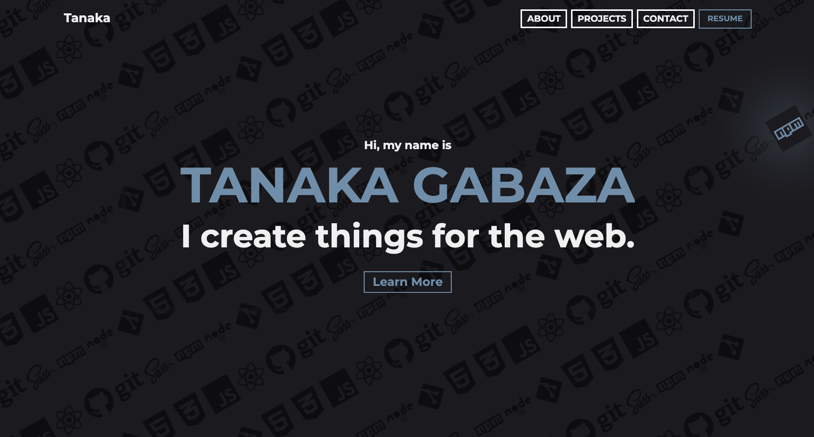

# Gatsby Simplefolio

<h1 align="center">
  tanakagabaza.com v1
</h1>

<h2 align="center">
  
  <br>
</h2>

## Features

- Modern UI Design + Reveal Animations
- One Page Layout built with React
- Styled with Bootstrap v4.3 + Custom SCSS
- Fully Responsive
- Image optimization with Gatsby

## Technologies used 🛠️

- [Gatsby](https://www.gatsbyjs.org/) - Static Site Generator
- [GraphQL](https://graphql.org/) - Query language for APIs
- [React](https://es.reactjs.org/) - Front-End JavaScript library
- [Bootstrap 4](https://getbootstrap.com/docs/4.3/getting-started/introduction/) - Front-End UI library
- [Sass](https://sass-lang.com/documentation) - CSS extension language

---

## Getting Started 🚀

### Prerequisites 📋

You'll need [Git](https://git-scm.com) and [Node.js](https://nodejs.org/en/download/) (which comes with [NPM](http://npmjs.com)) installed on your computer.\
Also you need to have installed [Gatsby CLI](https://www.gatsbyjs.org/docs/quick-start/)

```
node@v10.16.0 or higher
npm@6.9.0 or higher
git@2.17.1 or higher
gatsby-cli@2.8.22 or higher
```

Also, you can use [Yarn](https://yarnpkg.com/) instead of NPM ☝️

```
yarn@v1.21.1 or higher
```

---

## How To Use 🔧

From your command line:

```bash
# Clone this repository
$ git clone https://github.com/tagabaza/gatsby-portfolio-v1

# Go into the repository
$ cd gatsby-portfolio-v1

# Remove current origin repository
$ git remote remove origin
```

Then you can install the dependencies either using NPM or Yarn:

Using NPM:

```bash
# Install dependencies
$ npm install

# Start development server
$ npm run develop
```

Using Yarn:

```bash
# Install dependencies
$ yarn

# Start development server
$ yarn develop
```

## Deployment 📦

I highly recommend using [Netlify](https://netlify.com) to deploy the website once setup is completed.
